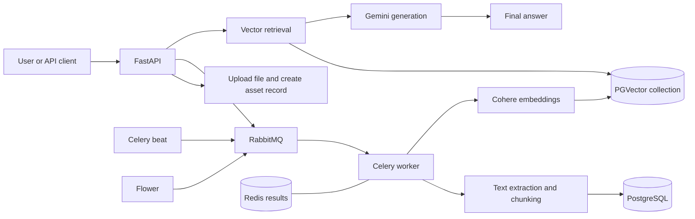

# MultiRagAPP

MultiRagAPP is a Dockerized FastAPI RAG backend for uploading documents, processing them into chunks, indexing them with embeddings, retrieving relevant chunks, and generating grounded answers.

The current validated runtime uses:

- FastAPI for the HTTP API.
- Celery for asynchronous file processing and vector indexing.
- RabbitMQ as the Celery broker.
- Redis as the Celery result backend.
- PostgreSQL with PGVector for relational records and vector storage.
- Qdrant as an available vector database service in the stack.
- Cohere for embeddings.
- Gemini for answer generation.

The verified provider configuration is `GENERATION_BACKEND=GEMINI`, `GENERATION_MODEL_ID=gemini-2.5-flash`, `EMBEDDING_BACKEND=COHERE`, `EMBEDDING_MODEL_ID=embed-multilingual-v3.0`, and `EMBEDDING_MODEL_SIZE=1024`.

## Architecture



The upload endpoint runs synchronously. Processing, chunk persistence, Cohere embedding, and vector indexing run asynchronously through Celery. Search and answer generation run synchronously in the API after vectors exist.

## Prerequisites

- Git
- Docker
- Docker Compose
- A Cohere API key
- A Gemini API key

No specific Docker or Compose version is pinned by this repository. Use a current Docker installation with Compose v2 support.

## Repository Structure

```text
.
|-- README.md
|-- docker/
|   |-- docker-compose.yml
|   |-- README.md
|   |-- env/
|   |   |-- .env.example.app
|   |   |-- .env.example.postgres
|   |   |-- .env.example.rabbitmq
|   |   |-- .env.example.redis
|   |   |-- .env.example.grafana
|   |   `-- .env.example.postgres-exporter
|   |-- minirag/
|   |   |-- Dockerfile
|   |   |-- entrypoint.sh
|   |   `-- alembic.example.ini
|   |-- nginx/
|   |-- prometheus/
|   `-- rabbitmq/
|-- docs/
|-- src/
|   |-- main.py
|   |-- celery_app.py
|   |-- routes/
|   |-- controllers/
|   |-- tasks/
|   |-- stores/
|   |-- models/
|   |-- assets/
|   `-- requirements.txt
`-- LICENSE
```

## Environment Configuration

Docker runtime configuration lives under `docker/env/`.

Create local runtime env files from the examples:

```bash
cd docker/env
cp .env.example.app .env.app
cp .env.example.postgres .env.postgres
cp .env.example.rabbitmq .env.rabbitmq
cp .env.example.redis .env.redis
cp .env.example.grafana .env.grafana
cp .env.example.postgres-exporter .env.postgres-exporter
```

Create the Docker Alembic config expected by the Dockerfile:

```bash
cd ../minirag
cp alembic.example.ini alembic.ini
```

Then edit `docker/env/.env.app` and add your own credentials:

```text
COHERE_API_KEY="your-cohere-api-key"
GEMINI_API_KEY="your-gemini-api-key"
```

Important runtime variables:

```text
GENERATION_BACKEND="GEMINI"
GENERATION_MODEL_ID="gemini-2.5-flash"
GEMINI_API_KEY="..."

EMBEDDING_BACKEND="COHERE"
EMBEDDING_MODEL_ID="embed-multilingual-v3.0"
EMBEDDING_MODEL_SIZE=1024
COHERE_API_KEY="..."

VECTOR_DB_BACKEND="PGVECTOR"
POSTGRES_HOST="pgvector"
POSTGRES_PORT=5432

CELERY_BROKER_URL="amqp://<user>:<password>@rabbitmq:5672/<vhost>"
CELERY_RESULT_BACKEND="redis://:<password>@redis:6379/0"
```

Inside Docker, service-to-service hostnames must use Compose service names:

- RabbitMQ: `rabbitmq:5672`
- Redis: `redis:6379`
- PostgreSQL/PGVector: `pgvector:5432`
- Qdrant: `qdrant:6333`

Do not use `localhost` for these container-to-container URLs. Inside a container, `localhost` means that same container, not another service.

The example file is a template. If its Celery URLs use `localhost`, change only the hosts in your local `docker/env/.env.app` to `rabbitmq` and `redis` for Docker runtime.

## Ports

The Docker Compose stack exposes these host ports:

| Service | Host URL or port | Notes |
| --- | --- | --- |
| Nginx | `http://localhost` | Proxies to FastAPI |
| FastAPI | `http://localhost:8000` | API and Swagger docs |
| Flower | `http://localhost:5555` | Celery dashboard |
| PostgreSQL/PGVector | `localhost:5400` | Maps to container port `5432` |
| Qdrant | `http://localhost:6333` | REST API and dashboard |
| Qdrant gRPC | `localhost:6334` | gRPC port |
| Prometheus | `http://localhost:9090` | Metrics server |
| Grafana | `http://localhost:3000` | Dashboards |
| Node exporter | `localhost:9100` | Host/container metrics |
| Postgres exporter | `localhost:9187` | PostgreSQL metrics |
| RabbitMQ AMQP | `localhost:5672` | Host access to broker |
| RabbitMQ management | `http://localhost:15672` | Broker management UI |
| Redis | `localhost:6379` | Host access to result backend |

FastAPI metrics are exposed at `/TrhBVe_m5gg2002_E5VVqS`.

## First-Time Startup

From a fresh clone:

```bash
git clone <repository-url>
cd MultiRagAgent
```

Configure the environment files as described above. Then start the stack from the `docker` directory:

```bash
cd docker
docker compose up --build -d
```

The first start builds the application images and starts the full stack. The application entrypoint runs Alembic migrations automatically before FastAPI, Celery worker, Celery beat, and Flower start.

Verify the containers:

```bash
docker compose ps
```

Verify the API:

```bash
curl http://localhost:8000/api/v1/
```

Expected response:

```json
{
  "app_name": "mini-RAG",
  "app_version": "0.1"
}
```

Swagger UI is available at:

```text
http://localhost:8000/docs
```

## RAG API Workflow

The official validated workflow is:

1. Upload a supported document.
2. Enqueue processing and vector indexing.
3. Check vector collection info.
4. Search the index.
5. Ask for a RAG answer.

The API endpoints are:

1. `POST /api/v1/data/upload/{project_id}`
2. `POST /api/v1/data/process-and-push/{project_id}`
3. `GET /api/v1/nlp/index/info/{project_id}`
4. `POST /api/v1/nlp/index/search/{project_id}`
5. `POST /api/v1/nlp/index/answer/{project_id}`

Supported file types are configured in `FILE_ALLOWED_TYPES`; the current Docker template allows `text/plain` and `application/pdf`.

### 1. Upload

```bash
curl -X POST "http://localhost:8000/api/v1/data/upload/1001" \
  -F "file=@sample.txt;type=text/plain"
```

Successful response:

```json
{
  "signal": "file_upload_success",
  "file_id": "1"
}
```

The returned `file_id` is the asset database id. To process all uploaded files for a project, omit `file_id` in the next request.

### 2. Process and Index

This step is asynchronous through Celery.

```bash
curl -X POST "http://localhost:8000/api/v1/data/process-and-push/1001" \
  -H "Content-Type: application/json" \
  -d '{"chunk_size": 80, "overlap_size": 20, "do_reset": 0}'
```

Successful enqueue response:

```json
{
  "signal": "process_and_push_workflow_ready",
  "workflow_task_id": "..."
}
```

The Celery workflow loads the uploaded file, extracts text, chunks content, writes chunk records to PostgreSQL, embeds chunks with Cohere, creates the PGVector collection if needed, and inserts vectors.

### 3. Check Index Info

```bash
curl "http://localhost:8000/api/v1/nlp/index/info/1001"
```

Successful response:

```json
{
  "signal": "vectordb_collection_retrieved",
  "collection_info": {
    "table_info": {
      "tablename": "collection_1024_1001"
    },
    "record_count": 2
  }
}
```

### 4. Search

```bash
curl -X POST "http://localhost:8000/api/v1/nlp/index/search/1001" \
  -H "Content-Type: application/json" \
  -d '{"text": "What is in the uploaded document?", "limit": 5}'
```

Successful response:

```json
{
  "signal": "vectordb_search_success",
  "results": [
    {
      "text": "...",
      "score": 0.62,
      "metadata": {
        "filename": "sample.txt",
        "file_type": "txt",
        "chunk_index": 0,
        "total_chunks": 2
      }
    }
  ]
}
```

### 5. Answer

```bash
curl -X POST "http://localhost:8000/api/v1/nlp/index/answer/1001" \
  -H "Content-Type: application/json" \
  -d '{"text": "Answer using only the uploaded document.", "limit": 5}'
```

Successful response:

```json
{
  "signal": "rag_answer_success",
  "answer": "...",
  "full_prompt": "...",
  "chat_history": [...]
}
```

## Verified Example

A validated smoke document contained:

```text
Runtime recovery smoke test document.
The retrieval keyword is metadata-preservation-sentinel.
This content should be chunked and indexed.
```

The workflow successfully produced:

- 1 project record.
- 1 asset record.
- 2 chunk records.
- PGVector collection `collection_1024_<project_id>`.
- 2 vector rows.
- Search results containing `metadata-preservation-sentinel`.
- A Gemini answer identifying `metadata-preservation-sentinel` as the retrieval keyword.

## Logs and Verification

Check container status:

```bash
cd docker
docker compose ps
```

View application logs:

```bash
docker compose logs --tail=100 fastapi
docker compose logs --tail=100 celery-worker
docker compose logs --tail=100 celery-beat
docker compose logs --tail=100 flower
```

Check Celery worker responsiveness:

```bash
docker compose exec celery-worker python -m celery -A celery_app inspect ping
docker compose exec celery-worker python -m celery -A celery_app inspect registered
```

Check RabbitMQ queues and consumers through the management UI:

```text
http://localhost:15672
```

The expected Celery queues are:

- `default`
- `file_processing`
- `data_indexing`

## Troubleshooting

If containers are stuck restarting, inspect their logs first:

```bash
docker compose logs --tail=200 fastapi celery-worker celery-beat flower
```

If FastAPI or Celery cannot connect to RabbitMQ, confirm `CELERY_BROKER_URL` in `docker/env/.env.app` uses `rabbitmq:5672`, not `localhost:5672`.

If Celery results or Flower behavior look wrong, confirm `CELERY_RESULT_BACKEND` uses `redis:6379`, not `localhost:6379`.

If PostgreSQL connection fails, confirm the Docker app environment uses `POSTGRES_HOST=pgvector` and `POSTGRES_PORT=5432`. From the host machine, PostgreSQL is exposed on port `5400`.

If Gemini generation fails, confirm `GEMINI_API_KEY` is present in `docker/env/.env.app` and `GENERATION_MODEL_ID` is `gemini-2.5-flash`.

If Cohere embedding fails, confirm `COHERE_API_KEY` is present, `EMBEDDING_MODEL_ID` is `embed-multilingual-v3.0`, and `EMBEDDING_MODEL_SIZE` is `1024`.

If retrieval fails after processing, check that the index-info endpoint reports a collection named `collection_1024_<project_id>` with `record_count` greater than `0`.

If vector insertion fails with dimension-related errors, make sure the embedding size and the existing PGVector collection dimension match. The validated Cohere configuration uses 1024-dimensional embeddings.

If the worker is not processing tasks, check:

```bash
docker compose ps celery-worker rabbitmq redis
docker compose logs --tail=100 celery-worker
docker compose exec celery-worker python -m celery -A celery_app inspect registered
```

## Stop, Start, Restart, and Rebuild

Stop containers without deleting volumes:

```bash
cd docker
docker compose stop
```

Start existing containers again:

```bash
docker compose start
```

Restart services without rebuilding:

```bash
docker compose restart fastapi celery-worker celery-beat flower
```

Rebuild after dependency or Docker image changes:

```bash
docker compose up --build -d
```

To remove containers while keeping named volumes:

```bash
docker compose down
```

Do not use `docker compose down -v` as a normal shutdown command. The `-v` flag removes named volumes and can delete PostgreSQL, Redis, RabbitMQ, Qdrant, Grafana, and Prometheus data.

## Security

Never commit runtime environment files containing real credentials.

- Do not commit `docker/env/.env.app`.
- Do not commit Gemini or Cohere API keys.
- Use `docker/env/.env.example.app` as the safe template.
- Keep real credentials local or in a secrets manager.

The Docker ignore rules in `docker/.gitignore` ignore `env/.env*` while allowing `env/.env.example.*` files.

## Current Project Scope

Currently implemented and validated:

- Document upload.
- Text extraction for supported text/PDF files.
- Chunk creation and metadata preservation.
- Celery process-and-push workflow.
- Cohere embeddings.
- PGVector indexing.
- Vector retrieval.
- Gemini answer generation.
- Full upload -> processing -> chunking -> embedding -> vector indexing -> retrieval -> answer E2E flow.

This repository is currently a dense-retrieval RAG backend. Agentic RAG, hybrid retrieval, reranking, citations, and conversation memory are not documented here as implemented features.
